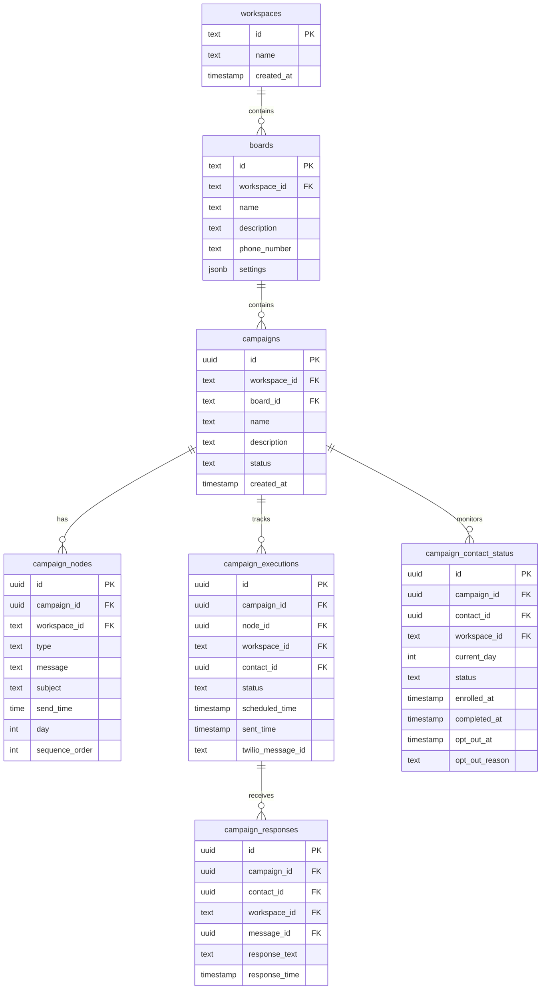
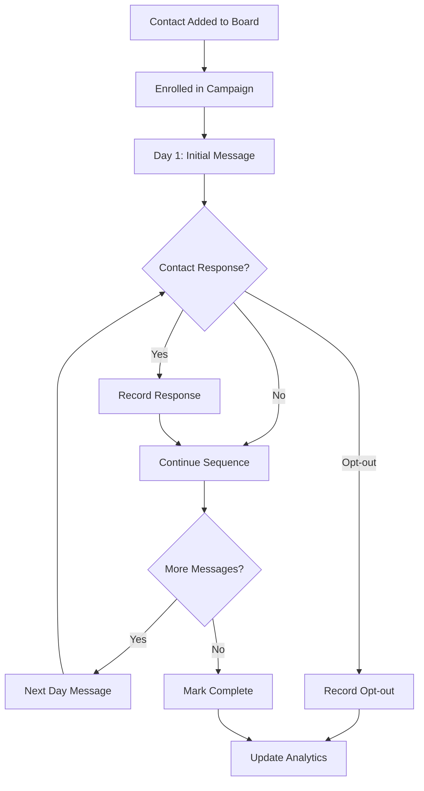

# Campaign Builder Analysis

## Purpose and Overview
The CampaignBuilder is a sophisticated component designed to create and manage automated communication sequences with contacts. It follows Mac OS design principles with clean interfaces, subtle animations, and intuitive user interactions.

## Core Functionality
1. Multi-step Campaign Creation:
   - Audience Selection
   - Campaign Flow Design
   - Review and Launch
   
2. Message Node Management:
   - Support for both Email and SMS messages
   - Day-based sequencing
   - Customizable send times
   - Rich text editing capabilities
   - Dynamic content snippets

## Integration with Text App and CRM
1. SMS Integration:
   - Direct integration with existing Twilio infrastructure
   - Scheduled message delivery
   - Template support for personalization
   
2. CRM Enhancement:
   - Audience segmentation capabilities
   - Contact journey automation
   - Campaign performance tracking
   - Multi-channel communication (Email + SMS)

## Current Implementation
The component uses a modern React implementation with:
- Chakra UI for consistent Mac OS-like styling
- Step-based workflow using Chakra's Stepper
- Rich text editing for message composition
- Dynamic node management for campaign sequences
- Real-time preview and editing capabilities

## Proposed Database Schema
```sql
-- Campaigns table
CREATE TABLE campaigns (
    id UUID PRIMARY KEY DEFAULT uuid_generate_v4(),
    workspace_id TEXT NOT NULL REFERENCES workspaces(id),
    name TEXT NOT NULL,
    status TEXT NOT NULL DEFAULT 'draft',
    segment_id UUID,
    created_at TIMESTAMPTZ DEFAULT NOW(),
    updated_at TIMESTAMPTZ DEFAULT NOW()
);

-- Campaign nodes table
CREATE TABLE campaign_nodes (
    id UUID PRIMARY KEY DEFAULT uuid_generate_v4(),
    campaign_id UUID REFERENCES campaigns(id),
    day INTEGER NOT NULL,
    type TEXT NOT NULL CHECK (type IN ('email', 'sms')),
    subject TEXT,
    message TEXT NOT NULL,
    send_time TIME NOT NULL,
    sequence_order INTEGER NOT NULL,
    created_at TIMESTAMPTZ DEFAULT NOW(),
    updated_at TIMESTAMPTZ DEFAULT NOW()
);

-- Campaign executions table
CREATE TABLE campaign_executions (
    id UUID PRIMARY KEY DEFAULT uuid_generate_v4(),
    campaign_id UUID REFERENCES campaigns(id),
    node_id UUID REFERENCES campaign_nodes(id),
    contact_id UUID REFERENCES contacts(id),
    status TEXT NOT NULL DEFAULT 'pending',
    scheduled_at TIMESTAMPTZ NOT NULL,
    executed_at TIMESTAMPTZ,
    created_at TIMESTAMPTZ DEFAULT NOW(),
    updated_at TIMESTAMPTZ DEFAULT NOW()
);
```

## Expert Feedback
1. User Experience:
   - Strong alignment with Mac OS design principles
   - Clear step-by-step workflow reduces complexity
   - Visual feedback through confetti animation on completion
   - Intuitive node-based campaign building

2. Areas for Improvement:
   - Add A/B testing capabilities
   - Implement campaign analytics dashboard
   - Add drag-and-drop node reordering
   - Include message preview functionality
   - Add campaign templates for quick starts

## Roadmap
1. Phase 1 - Core Functionality:
   - Basic campaign builder interface
   - Email and SMS support
   - Step-based workflow
   - Rich text editing

2. Phase 2 - Enhanced Features:
   - Campaign analytics and reporting
   - A/B testing implementation
   - Template library
   - Advanced segmentation

3. Phase 3 - Advanced Automation:
   - Conditional branching
   - Dynamic content personalization
   - Integration with external marketing tools
   - Advanced campaign metrics

4. Phase 4 - Optimization:
   - Performance analytics
   - Machine learning for send time optimization
   - Advanced personalization
   - Multi-language support

## Integration Recommendations
1. Immediate:
   - Implement the proposed database schema
   - Add campaign analytics tracking
   - Create campaign templates system
   - Integrate with existing contact management

2. Future:
   - Add webhook support for external integrations
   - Implement campaign performance metrics
   - Create campaign template marketplace
   - Add AI-powered content suggestions

## Campaign Analytics & Tracking Implementation Plan

### 1. Database Schema Extensions

#### Campaign Contact Status Tracking
```sql
CREATE TABLE campaign_contact_status (
    id UUID PRIMARY KEY DEFAULT uuid_generate_v4(),
    campaign_id UUID NOT NULL,
    contact_id UUID NOT NULL,
    workspace_id TEXT NOT NULL,
    current_day INTEGER,
    status TEXT NOT NULL,
    enrolled_at TIMESTAMPTZ DEFAULT NOW(),
    completed_at TIMESTAMPTZ,
    opt_out_at TIMESTAMPTZ,
    opt_out_reason TEXT,
    last_response_at TIMESTAMPTZ,
    
    CONSTRAINT fk_campaign
        FOREIGN KEY (campaign_id, workspace_id)
        REFERENCES campaigns(id, workspace_id)
        ON DELETE CASCADE,
    CONSTRAINT fk_contact
        FOREIGN KEY (contact_id, workspace_id)
        REFERENCES contacts(id, workspace_id)
        ON DELETE CASCADE,
    CONSTRAINT valid_status
        CHECK (status IN ('enrolled', 'in_progress', 'completed', 'opted_out'))
);

-- Index for performance
CREATE INDEX idx_campaign_contact_status_lookup 
ON campaign_contact_status(campaign_id, workspace_id, status);
```

#### Campaign Response Tracking
```sql
CREATE TABLE campaign_responses (
    id UUID PRIMARY KEY DEFAULT uuid_generate_v4(),
    campaign_id UUID NOT NULL,
    contact_id UUID NOT NULL,
    workspace_id TEXT NOT NULL,
    message_id UUID NOT NULL,
    response_text TEXT NOT NULL,
    response_time TIMESTAMPTZ DEFAULT NOW(),
    
    CONSTRAINT fk_campaign
        FOREIGN KEY (campaign_id, workspace_id)
        REFERENCES campaigns(id, workspace_id),
    CONSTRAINT fk_contact
        FOREIGN KEY (contact_id, workspace_id)
        REFERENCES contacts(id, workspace_id)
);
```

### 2. Analytics Views

#### Contact Enrollment Stats
```sql
CREATE VIEW campaign_enrollment_stats AS
SELECT 
    c.id as campaign_id,
    c.workspace_id,
    COUNT(DISTINCT cs.contact_id) as total_enrolled,
    COUNT(DISTINCT CASE WHEN cs.status = 'in_progress' THEN cs.contact_id END) as active_contacts,
    COUNT(DISTINCT CASE WHEN cs.status = 'completed' THEN cs.contact_id END) as completed_contacts,
    COUNT(DISTINCT CASE WHEN cs.status = 'opted_out' THEN cs.contact_id END) as opted_out_contacts
FROM campaigns c
LEFT JOIN campaign_contact_status cs ON c.id = cs.campaign_id
GROUP BY c.id, c.workspace_id;
```

#### Day-wise Distribution
```sql
CREATE VIEW campaign_day_distribution AS
SELECT 
    campaign_id,
    workspace_id,
    current_day,
    COUNT(contact_id) as contacts_in_day
FROM campaign_contact_status
WHERE status = 'in_progress'
GROUP BY campaign_id, workspace_id, current_day;
```

#### Lead Source Performance
```sql
CREATE VIEW campaign_lead_source_performance AS
SELECT 
    c.id as campaign_id,
    c.workspace_id,
    co.lead_source,
    COUNT(DISTINCT cs.contact_id) as total_contacts,
    COUNT(DISTINCT CASE WHEN co.appointment_status_id IS NOT NULL THEN cs.contact_id END) as scheduled_appointments,
    COUNT(DISTINCT CASE WHEN cr.id IS NOT NULL THEN cs.contact_id END) as responded_contacts
FROM campaigns c
JOIN campaign_contact_status cs ON c.id = cs.campaign_id
JOIN contacts co ON cs.contact_id = co.id
LEFT JOIN campaign_responses cr ON c.id = cr.campaign_id AND cs.contact_id = cr.contact_id
GROUP BY c.id, c.workspace_id, co.lead_source;
```

### 3. Frontend Implementation

#### Analytics Components
1. **TimeMetrics** (`/Analytics/TimeMetrics.js`)
   - Real-time performance metrics display
   - Average completion time tracking
   - Response time distribution
   - Best performing hours analysis
   - Responsive stat cards with tooltips

2. **SequencePerformance** (`/Analytics/SequencePerformance.js`)
   - Day-by-day campaign progression
   - Drop-off rate analysis
   - Contact engagement tracking
   - Visual progress indicators
   - Interactive data table

3. **BoardComparison** (`/Analytics/BoardComparison.js`)
   - Cross-board performance metrics
   - Ranking visualization
   - Success rate comparisons
   - Performance badges
   - Sortable data grid

4. **Main Dashboard** (`/Analytics/index.js`)
   - Unified analytics view
   - Real-time data refresh
   - Loading states
   - Error handling
   - Mac OS-inspired design

#### Data Management
1. **Custom Hook** (`/hooks/useCampaignAnalytics.js`)
   ```javascript
   const {
     timeMetrics,
     sequenceData,
     boardComparison,
     isLoading,
     refreshAnalytics
   } = useCampaignAnalytics(workspaceId, boardId);
   ```
   - Centralized state management
   - Real-time Supabase subscriptions
   - Automatic data refresh
   - Error handling with toasts
   - Manual refresh capability

#### Design Principles
1. **UI Components**
   - Clean, minimal interface
   - Consistent spacing and typography
   - Responsive layouts
   - Interactive elements
   - Informative tooltips

2. **User Experience**
   - Real-time updates
   - Loading indicators
   - Error notifications
   - Data visualization
   - Intuitive navigation

3. **Performance**
   - Optimized re-renders
   - Efficient data fetching
   - Cached analytics
   - Background updates
   - Minimal network requests

#### Integration Points
1. **Database Views**
   - campaign_time_metrics
   - campaign_sequence_performance
   - board_performance_ranking

2. **Real-time Updates**
   ```javascript
   // Supabase subscription example
   const subscription = supabase
     .channel('analytics_changes')
     .on('postgres_changes',
       { event: '*', schema: 'public', table: 'campaign_time_metrics' },
       (payload) => handleDataUpdate(payload)
     )
     .subscribe();
   ```

3. **Error Handling**
   ```javascript
   // Toast notification pattern
   toast({
     title: 'Error fetching analytics',
     description: error.message,
     status: 'error',
     duration: 5000,
     isClosable: true
   });
   ```

#### Next Steps
1. **Testing**
   - Unit tests for components
   - Integration tests
   - Performance testing
   - Cross-browser compatibility

2. **Features**
   - Export functionality
   - Custom date ranges
   - Advanced filtering
   - Comparative analysis

3. **Optimization**
   - Query optimization
   - Caching strategy
   - Load time improvement
   - Memory management

### 4. API Endpoints

```typescript
// Campaign Analytics
GET /api/campaigns/:id/analytics
  - Enrollment stats
  - Day-wise distribution
  - Response rates
  - Conversion metrics

// Lead Source Performance
GET /api/campaigns/:id/lead-source-performance
  - Performance by source
  - Conversion rates
  - ROI metrics

// Contact Status
GET /api/campaigns/:id/contact-status
  - Current day distribution
  - Status changes
  - Response history
```

### 5. Real-time Updates

1. WebSocket Integration
   - Status changes
   - New responses
   - Milestone achievements

2. Background Jobs
   - Daily status updates
   - Sequence progression
   - Performance calculations

### 6. Performance Considerations

1. Materialized Views
   - Refresh analytics periodically
   - Cache common queries

2. Indexes
   - Optimize for common filters
   - Support range queries

3. Data Retention
   - Archive completed campaigns
   - Maintain summary statistics

### 7. Implementation Phases

#### Phase 1: Core Tracking
- Set up database schema
- Implement basic status tracking
- Create fundamental views

#### Phase 2: Analytics
- Build dashboard components
- Implement API endpoints
- Set up real-time updates

#### Phase 3: Advanced Features
- Lead source analytics
- Conversion tracking
- Performance optimization

#### Phase 4: Reporting
- Export capabilities
- Custom metrics
- Automated reports

This implementation aligns with the project's focus on clean, reliable code while maintaining Mac OS design principles and providing powerful campaign management capabilities.

## Campaign Builder Documentation

## Overview
The Campaign Builder is a core component of our Twilio-based texting application that enables users to create, manage, and track SMS campaigns across different boards within a workspace. Following Mac OS design principles, it provides an intuitive interface for campaign management and analytics.

## System Architecture

### Database Schema


### Contact Journey Flow


### Project Structure
```
deepseek-test-livechat/
├── frontend/
│   ├── src/
│   │   ├── components/
│   │   │   └── board/
│   │   │       ├── CampaignBuilder/
│   │   │       │   ├── index.js
│   │   │       │   ├── CampaignForm.js
│   │   │       │   ├── SequenceBuilder.js
│   │   │       │   ├── MessageEditor.js
│   │   │       │   └── Analytics/
│   │   │       │       ├── TimeMetrics.js
│   │   │       │       ├── SequencePerformance.js
│   │   │       │       └── BoardComparison.js
│   │   └── hooks/
│   │       └── useCampaignAnalytics.js
├── sql/
│   ├── 01_create_campaign_tables.sql
│   ├── 02_create_campaign_nodes.sql
│   └── 03_create_campaign_analytics.sql
└── board/
    └── CampaignBuilder.md
```

## Analytics Implementation

### Time-based Analytics View
```sql
campaign_time_metrics
- Average completion time per campaign
- Response time distribution
- Best performing time slots
- Message effectiveness by hour
```

### Sequence Performance View
```sql
campaign_sequence_performance
- Day-by-day drop-off analysis
- Contact progression tracking
- Sequence effectiveness metrics
```

### Board Performance View
```sql
board_performance_ranking
- Campaign success rates
- Response rates
- Completion rankings
- Cross-board comparisons
```

## Security Implementation
- Row Level Security (RLS) on all tables
- Workspace isolation
- Board-level access control
- Secure data access patterns

## Next Steps

### Frontend Development
1. Analytics Dashboard
   - Time-based metrics visualization
   - Sequence performance charts
   - Board comparison tables
   - Mac OS-inspired design

2. Campaign Management UI
   - Campaign creation workflow
   - Message sequence builder
   - Contact enrollment interface
   - Real-time status updates

3. Performance Features
   - WebSocket integration
   - Optimistic updates
   - Cached analytics
   - Error handling with toasts

### Backend Tasks
1. API Endpoints
   ```typescript
   GET /api/campaigns/:id/analytics
   GET /api/campaigns/:id/sequence-performance
   GET /api/boards/:id/performance
   ```

2. Performance Optimization
   - Query optimization
   - Caching strategy
   - Background jobs

### Testing Strategy
1. Unit Tests
   - Component testing
   - Analytics calculations
   - Data validation

2. Integration Tests
   - End-to-end workflows
   - Multi-tenant scenarios
   - Performance benchmarks
