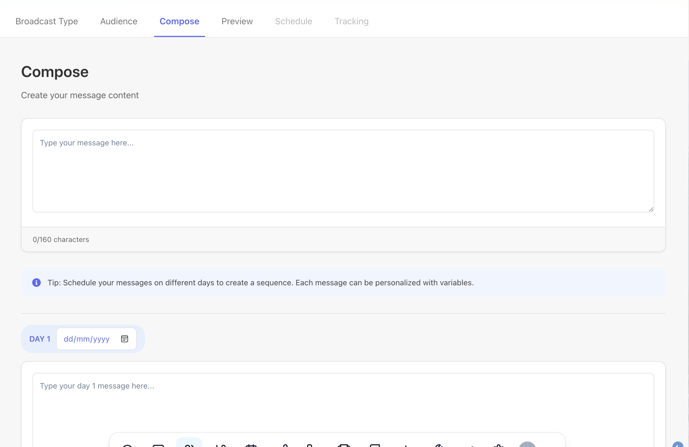

Broadcast - This feature allows admin/agent  send an email/sms broadcast in one message or multi day message to customers.

Broadcast type - Email or SMS. Email - this allow user to create and send email broadcast using contact email address from contacts.email table. SMS - this allows users to send one off or multi day text message. It's using contacts phone_number from contacts table. 

Select Your Audience - this allows user to choose the contacts he/she's broadcasting. The filters should be whatever is the contacts table fields.metadata - jsonb : this should be whatever is on the contacts filed on the contacts table level.

lead_source
market
product
Lead_status
state
zip
conversation_statusTags,
Appointment  Statusthe displaying of Matched contacts  based on criteria should be real time rendering. 

Once contacts are matched this should be save on a table in supabase with contacts information for history retrieval or analytics.    purposes 

I think we may need another table to save how many sequence with column of date and time of scheduled sending and broadcast type (sms, or email or sms&email) and of course the contents of the broadcast. The the day sequence should have their ow scheduled time like day 1 is scheduled at 04-10-2025.

Schedule Your Broadcast

Both the Send immediately and Schedule for later should be using > queue-services endpoint. See sample. In the tracking tab, show the numbers :

Recipients
Delivered

Delivery Status:
Delivered - delivery status based on Twilio data
Failed - delivery status based on Twilio data
Pending - any scheduled contacts to be sent 

Please help in designing what table schema to be used for tracking above.

# Areas for Consideration

## Performance and Scalability
- Real-time audience filtering optimization for large datasets
- Implement caching strategies for frequently accessed data
- Pagination for large recipient lists
- Database indexing for common queries
- Queue management for high-volume broadcasts

## Error Handling and Reliability
- Robust error handling for failed deliveries
- Retry strategies for failed messages
- API rate limit handling (Twilio, email service)
- Fallback mechanisms for service outages
- Logging and monitoring system

## Cost Management
- SMS cost estimation before sending
- Budget limits and warning systems
- Usage analytics and reporting
- Cost optimization suggestions
- Billing integration

## Security and Compliance
- Rate limiting for API endpoints
- Input validation and sanitization
- GDPR and privacy compliance
- Audit logging
- Data retention policies

# Implementation Roadmap

## Phase 1: Core Functionality (MVP)
1. Basic Broadcast Creation
   - SMS implementation
   - Simple audience filtering
   - Basic scheduling
   - Essential tracking
   - Basic UI components

2. Database Foundation
   - Core tables setup
   - Basic indexing
   - Essential relationships

3. Basic Integration
   - Twilio SMS integration
   - Queue service setup
   - Basic error handling

## Phase 2: Enhancement
1. Channel Expansion
   - Email support
   - Multi-channel campaigns
   - Channel preference management

2. Advanced Audience Management
   - Complex filtering
   - Audience segmentation
   - Dynamic lists
   - Real-time preview

3. Sequence Management
   - Multi-day sequences
   - Custom scheduling
   - Sequence templates
   - Drag-and-drop sequence builder

4. Enhanced Analytics
   - Detailed delivery tracking
   - Performance metrics
   - Custom reports
   - Export functionality

## Phase 3: Advanced Features
1. Testing and Optimization
   - A/B testing
   - Performance analytics
   - Content optimization
   - Send time optimization

2. Template System
   - Template management
   - Dynamic content
   - Personalization tokens
   - Template categories

3. Campaign Management
   - Campaign duplication
   - Saved audiences
   - Campaign calendar
   - Workflow automation

4. Integration and Extension
   - API expansion
   - Webhook support
   - Third-party integrations
   - Custom extension points

# Best Practices

## Database
- Use appropriate indexes for performance
- Implement efficient querying patterns
- Regular maintenance and optimization
- Backup and recovery procedures

## API Design
- RESTful endpoints for each function
- WebSocket for real-time updates
- Proper authentication and authorization
- Rate limiting and security measures

## UI/UX
- Progressive disclosure of features
- Clear feedback on all actions
- Mobile-responsive design
- Accessibility compliance

## Testing Strategy
- Unit tests for core logic
- Integration tests for services
- E2E tests for critical flows
- Performance testing
- Security testing

# Future Considerations

## Scalability
- Horizontal scaling capabilities
- Load balancing
- Caching strategies
- Performance optimization

## Integration
- CRM system integration
- Analytics platforms
- Marketing automation
- Custom webhooks

## Advanced Features
- AI-powered content suggestions
- Automated optimization
- Advanced analytics
- Custom reporting

## Compliance
- GDPR compliance
- Data privacy
- Security auditing
- Industry regulations

